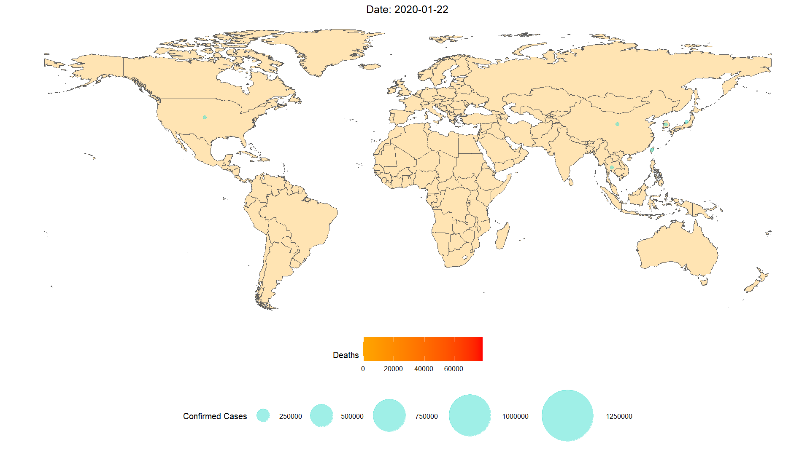
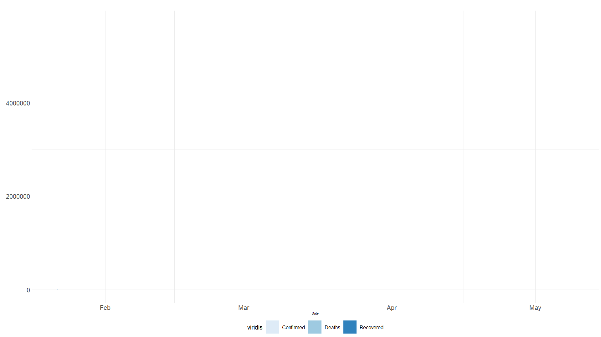

```{r setup, include=FALSE}
knitr::opts_chunk$set(echo = FALSE, comment = NA, warning = FALSE)
library(dplyr)
#library(lubridate)
library(ggplot2)
library(gganimate)
# library(rnaturalearth)
# library(rnaturalearthdata)
#library(ggmap)
# library(tmap)
library(plotly)
library(sf)
library(spData)
# library(countrycode)
library(googleVis)
library(tidyr)
#library(magick)
#library(leaflet)
options(scipen=10000) #Remove scientific notation from ggplot legend
```

```{r get-data, include=FALSE, eval=FALSE}
#Read data in
dat = readRDS("Shiny/app/ncov-dat.rds")

#If current data is old, get new data
#I add 1 to max date because online data is only updated at the end of each day
if(max(dat$Date) +1 < Sys.Date()){
  source("get-clean-data.R")
  dat = readRDS("Shiny/app/ncov-dat.rds")
}
#Read in only most recent day's data
ncov_newest = readRDS("Shiny/app/ncov-newest.rds")
```

```{r remove-geom-data, eval = FALSE}
#Remove geom data from 'dat' dataset to speed up processing
dat_min = dat %>%
  select(-c(geometry))

#Keep one set of geometry data
dat_geom = ncov_newest %>%
  select(c(Country, geometry))
dat_geom = st_as_sf(dat_geom)
```

```{r totals, eval = FALSE}
#Create data frame of cumulative counts
totals = dat_min %>%
  select(c("Date", "Confirmed", "Recovered", "Deaths")) %>%
  group_by(Date) %>%
  summarise_all(list(sum)) %>%
  gather(key = "Type", value = "Number", -Date)
```

```{r animation-map, eval = F}
p = ggplot(data = dat) +
  geom_sf(aes(geometry = geometry,
              fill = Deaths),
          alpha = 0.4) +
  coord_sf(datum = NA) +
  geom_point(aes(x = X, y = Y,
                 size = ifelse(Confirmed==0, NA, Confirmed)),
             shape = 21,
             colour = "turquoise",
             alpha = 0.3,
             fill = "blue") +
  scale_radius(range = c(4, 60), name = "Confirmed Cases") +
  scale_fill_gradient2(low = ("blue"),
                       mid = "orange",
                       high = ("red"),
                       midpoint = 35) +
  theme_minimal() +
  labs(title = "Date: {current_frame}", x = "", y = "") +
  theme(plot.title = element_text(hjust = 0.5,
        vjust = 0.05,
        size = 30),
      legend.position = "bottom",
      legend.direction = "horizontal",
      legend.title = element_text(size = 20),
      legend.text = element_text(size = 20),
      legend.key.width = unit(3, "cm"),
      legend.box = "vertical",
      legend.text.align = 0.5) +
  transition_manual(Date) +
  guides(color = F)

gif = animate(p, renderer = gifski_renderer(loop = T), width = 1920, height = 1080)
gif
anim_save(filename = "Gif - Fill Deaths - Point Cases.gif",
          path = "Gifs")
```

```{r animation-cases, eval=FALSE}
#Get total number of confirmed cases
cases = totals %>%
  filter(Type == "Confirmed") %>%
  select(c("Date", "Number"))

plot_line = ggplot(data = totals,
                   aes(x = Date, 
                       y = Number,
                       fill = Type)) +
  geom_area() +
  theme_minimal() +
  labs(title = "",
       x = "",
       y = "") +
  scale_fill_manual(name = "", values = c("lightcoral", "lightgoldenrod1", "palegreen")) +
  theme(plot.title = element_text(hjust = 0.5,
        vjust = 0.05,
        size = 25),
      axis.text = element_text(size = 23),
      legend.position = "bottom",
      legend.direction = "horizontal",
      legend.title = element_text(size = 20),
      legend.text = element_text(size = 20),
      legend.key.size = unit(1.5, "cm"),
      legend.text.align = 0.5) +
  transition_reveal(Date)
  

animate(plot_line, renderer = gifski_renderer(loop = TRUE), width = 1920, height = 1080)
anim_save(filename = "Line.gif", 
          path = "Gifs")
```

# Written Piece

COVID-19 has, in the literal sense, gone viral this year. Every day, we see graphs and infographics, news articles and interviews, and it's often quite difficult making sense of these sources of information. This has lead to a rise in 'Facebook Virologists' and 'WhatsApp Journalists' who spread news far and wide without fully understanding it, or knowing where it came from. Particularly now, during a global pandemic, this is dangerous and irresponsible (see [the bleach cure](https://www.bbc.com/news/world-us-canada-52407177)).Today we're going to unpack what we think are two of the more useful animations, and also point out some things you need to be careful of when interpreting any sort of statistical visualisation.

Before we take a look at some graphics though, it's important to know that comparisons between countries are generally not a good idea. Different countries are just that - different! They have different populations with different socio-economic circumstances, different economies, different healthcare systems and different priorities. These differences make it very difficult to accurately compare the impact of COVID-19 in multiple countries and we need to be aware of this. For example, one shouldn't be suprised to find out that the USA has way more deaths due to the virus than New Zealand. Firstly, the US has a population far greater than New Zealand's. Secondly, the US has more confirmed cases. Thirdly, the US had its first case before New Zealand so the virus has had more time to run its course in the US.

Of course, comparisons can still be made but we just need to be aware that there are differences and it might be one of these underlying differences that explains something, not what we think it is! In fact, it's important that we do still make comparisons in order to try and learn from the experiences of other countries.

## The Map

The first animation is the classic map.



This is one of the nicer animations out there simply because it can show a fair amount of information, while still being quite easily intepreted. 

Firstly, we can see that the title is running through dates so we know that the picture is changing as time goes on (this is pretty much always the case for COVID-19 GIFs because that's what we want to see: how things change over time!). Secondly, we need to take careful note of the legends so we can get a better understanding of what this GIF is showing us. In this case, there are two legends. The colour scale shows us the number of deaths in a country while the size of the circle over a country indicates the number of confirmed cases.

Based on this animation, we can see there was a fairly long period where only a handful of countries had confirmed cases of the virus. After this period though, the virus quickly spreads through Europe and then through Africa and South America. This confirms that countries with lots of international travel were more likely to develop cases before countries without international travel. 

We can also see that the US has confirmed significantly more cases that any other country. As mentioned earlier, we must be careful when trying to explain why this is. Not surprisingly (see [below][The Line Graph]), the more cases the US develops, the faster even more cases develop.

## The Line Graph



(Technically this is actually an area graph. A line graph wouldn't have the coloured in areas.)

We can see that the x-axis shows the date and the y-axis shows a number. Based on the legend, we know that this graph is showing us the number of confirmed cases, deaths and recoveries as time goes on.

When it comes to this type of graph (or a line graph), we often hear the term "exponential" along with it. This means that the growth in number of confirmed cases/death/recoveries is increasing at a faster and faster rate every day. When you think about it, this makes sense: if you start with 1 infection and that person infects 3 others, then those 3 go on to infect 3 more and so on. Pretty soon you've got thousands of infections! 

In this case, we can clearly see the exponential shape, particularly in the number of confirmed cases. It's interesting to note that the curve stays fairly flat until about mid-March, where it starts to really pick up quite quickly. If we take a look back at the map, we can see that around mid-March is when the virus started appearing in lots of countries, which makes sense.


One thing that's important to note with this graph is that confirmed cases, deaths and recoveries aren't actually happening all at the same time, as the graph seems to suggest. Recovering from COVID-19 can take up to two weeks so the number of recoveries reported today is actually linked to the number of confirmed cases reported between today and two weeks ago. This probably leads to a slightly higher recovery rate than this graph seems to suggest but also a slightly higher mortality rate!


